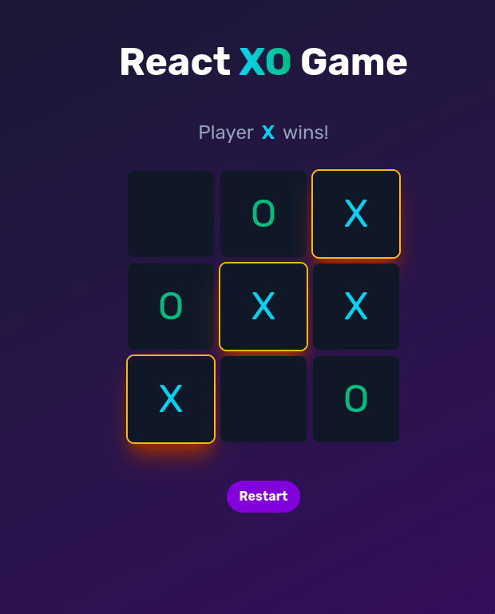
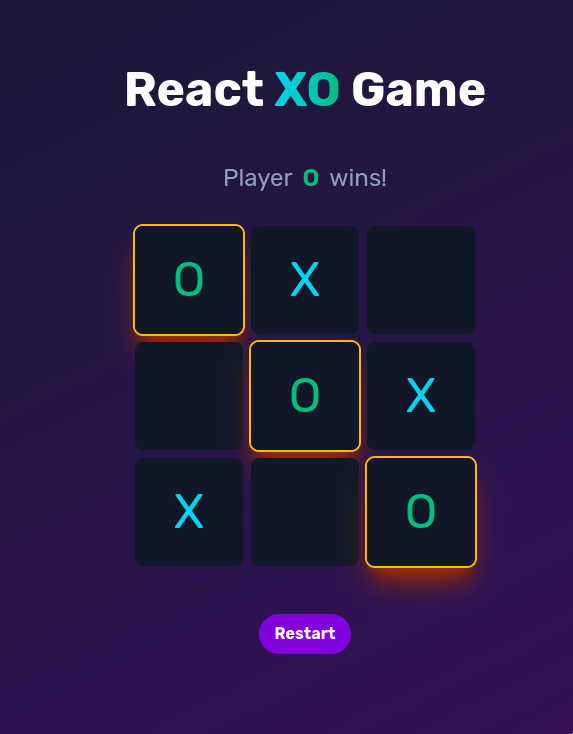
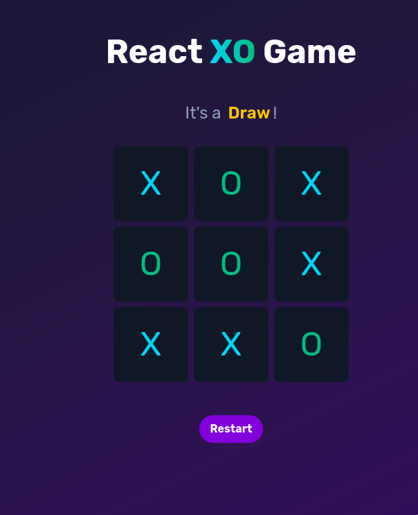

# 🎮 React Tic-Tac-Toe

A modern Tic-Tac-Toe game built with **React** and **Tailwind CSS** — featuring clean UI, winner highlighting, draw detection, and instant reset.  
A fun mini-project to practice components, hooks, and state logic in React.

---

## 🚀 Features

- Component-based structure (Board, Tile, GameStatus, ResetButton)
- Winner and draw detection
- Highlighted winning tiles
- Responsive and minimalist UI
- Instant restart button

---

## 🧩 Tech Stack

- **React** – UI library
- **Tailwind CSS** – styling and layout
- **JavaScript (ES6+)** – logic and interactivity

---

## 📂 Folder Structure

```
react-tictactoe/
├── public
│   └── XOLogo.png
├── assets/
│   ├── preview1.jpg
│   ├── preview2.jpg
│   └── preview3.jpg
├── src
│   ├── App.jsx
│   ├── Components
│   │   ├── Board.jsx
│   │   ├── GameStatus.jsx
│   │   ├── ResetButton.jsx
│   │   └── Tile.jsx
│   ├── index.css
│   ├── main.jsx
│   └── Utils
│       └── CheckWinner.jsx
├── eslint.config.js
├── index.html
├── package.json
├── package-lock.json
├── README.md
└── vite.config.js
```

---

## 💡 How to Run

1. Clone the repository:

   ```bash
   git clone https://github.com/your-username/react-tictactoe.git
   cd react-tictactoe
   ```

2. Install dependencies

   ```bash
   npm install
   ```

3. Start the development server

   ```bash
   npm run dev
   ```

4. Open your browser at http://localhost:5173 (Vite default)

---

## 🖼️ Preview







---

## 🎯 Future Ideas

- Add single-player mode with AI (Minimax algorithm)
- Track player scores using localStorage
- Add sound effects and smooth animations
- Add theme toggle (light/dark)
- Convert to multiplayer using WebSockets or Firebase

---

## 🧠 Learnings

- React state management with hooks
- Component-driven architecture
- Conditional rendering and event handling
- Responsive UI design with Tailwind CSS

---
